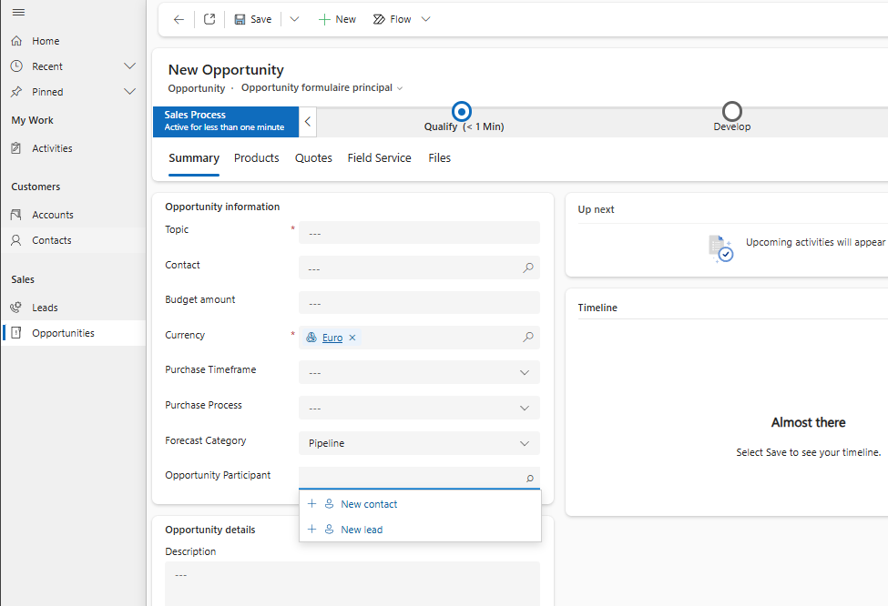
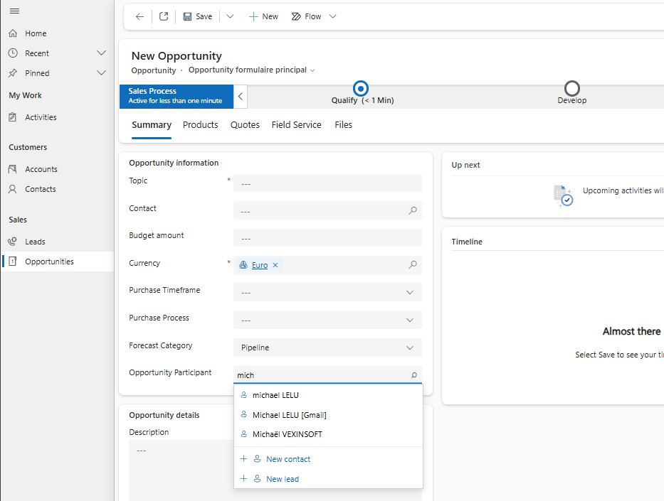
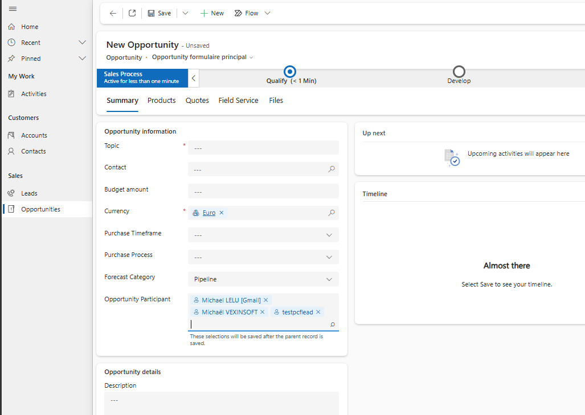

# Multi Junction Lookup PCF

A generic Power Apps Component Framework control that lets users select records from two Dataverse tables in one field. Each selection is persisted as a row in a configurable junction table.

The control supports existing parent records and selections made before the parent is saved for the first time.

# Why this project?

Dataverse already provides:

- Lookup columns
- Customer columns
- PartyList columns
- Native N:N relationships

However, many business scenarios require something slightly different:

- selecting records from different tables
- storing additional information on the relationship
- filtering by role
- filtering by type
- preserving selections before the parent record exists
- using a modern multi-select UI

This control fills that gap while remaining completely generic.

No business logic is embedded in the code.

Everything is configured through manifest properties.

## Features

- Search two configurable Dataverse tables from one lookup-style field.
- Add multiple records and display them as removable tags.
- Persist one junction-table row per selected record.
- Load and remove existing junction rows.
- Optional Quick Create for each target table, disabled by default.
- Open selected records from their tags.
- Preserve selections made before the parent record receives an ID.
- Optional cached display-name, type, and role columns.
- Built-in configuration validation and user-visible runtime diagnostics.
- Optional icons and placeholder.

# Typical use cases

This control can be used for many scenarios.

Examples include:

- Opportunity → Contacts + Leads
- Event → Speakers + Sponsors
- Project → Internal Users + External Contacts
- Ticket → Customers + Suppliers
- Visit → Contacts + Accounts
- Marketing Campaign → Contacts + Leads
- Meeting → Employees + Guests
- Custom tables requiring role-based relationships

Because the control relies only on configuration, no code changes are required.

## Architecture

Each file has one main responsibility:

- `config/configParser.ts`: converts manifest properties into a typed configuration.
- `config/configValidator.ts`: validates required and mutually dependent settings.
- `services/DataverseService.ts`: thin wrapper around the PCF Web API.
- `services/SearchService.ts`: searches the configured target tables.
- `services/JunctionService.ts`: loads, creates, deletes, and updates junction data.
- `utils/pendingItems.ts`: serializes selections made before the first parent save.
- `utils/errorDiagnostics.ts`: converts Dataverse errors into actionable diagnostics.
- `components/DiagnosticPanel.tsx`: displays configuration and runtime errors.
- `components/`: lookup field, search results, tags, icons, and create actions.

## Required Dataverse structure

The junction table must contain:

1. One lookup to the parent table.
2. One lookup to target table 1.
3. One lookup to target table 2.

Only one target lookup should be populated on each junction row.

Example:

| Junction row | Parent | Target 1 | Target 2 |
|---|---|---|---|
| 1 | Opportunity A | Contact A | |
| 2 | Opportunity A | Contact B | |
| 3 | Opportunity A | | Lead A |

Optional junction columns can store:

- the selected record display name;
- a numeric target-type value;
- a numeric role value when several controls share the same junction table.

## Bound pending field

The `Pending value` property must be bound to a text column on the parent form.

When the parent record has not yet been saved, the control stores selected items as JSON in this column. After the first save, the junction rows are created and the pending field is cleared.

This support column can be hidden on the form, but the control itself must remain bound to it.

## Configuration reference

### Junction table

| Property | Required | Description |
|---|:---:|---|
| Pending value | Yes | Bound text column used before the first parent save. |
| Junction table | Yes | Logical name of the junction table, for example `mjl_opportunityparty`. |
| Junction primary ID | Yes | Logical name of the junction table primary ID. |
| Cached display name column | No | Text column that receives the selected record name. |
| Junction type column | No | Numeric or choice column identifying which target table is used. |
| Junction role column | No | Numeric or choice column used to isolate a role. |
| Junction role value | No | Value written to and filtered from the role column. |

### Parent table

| Property | Required | Description |
|---|:---:|---|
| Parent table | Yes | Logical name of the table hosting the control. |
| Parent entity set | Yes | OData entity-set name, usually the plural table name. |
| Parent navigation property | Yes | Web API navigation property for the parent lookup on the junction table. |

### Target tables

The following settings exist for both Target 1 and Target 2:

| Property | Required | Description |
|---|:---:|---|
| Table | Yes | Logical table name. |
| Entity set | Yes | OData entity-set name. |
| Primary ID | Yes | Logical primary ID column. |
| Primary name | Yes | Column used for search and display. |
| Navigation property | Yes | Web API navigation property for the target lookup on the junction table. |
| Label | No | User-facing label used by create actions. |
| Icon | No | `person`, `building`, or `generic`. Empty uses the generic icon. |
| Allow creation | No | Enables Quick Create. Default: `false`. |
| Type value | No | Value written when a junction type column is configured. |

### Search

| Property | Default | Description |
|---|---:|---|
| Minimum search length | `3` | Characters required before Dataverse search starts. |
| Placeholder | Empty | Optional input placeholder. |

## Example: Opportunity participants

This example lets users select Contacts and Leads from an Opportunity form.

### Tables

- Parent: `opportunity`
- Target 1: `contact`
- Target 2: `lead`
- Junction table: custom `Opportunity Party`

### Junction columns

- Lookup to Opportunity.
- Lookup to Contact.
- Lookup to Lead.
- Optional primary name text column.

### Example values

The following example shows the exact values expected by the control.

> **Important**
> These values are **Dataverse metadata names**, not display names.

```text
Junction table
  Value : vxs_opportunityparty
  Type  : Dataverse table logical name

Junction primary ID
  Value : vxs_opportunitypartyid
  Type  : Primary Key column (Unique Identifier)

Cached display name column
  Value : vxs_name
  Type  : Single Line of Text column (optional)


Parent table
  Value : opportunity
  Type  : Dataverse table logical name

Parent entity set
  Value : opportunities
  Type  : OData Entity Set name

Parent navigation property
  Value : vxs_opportunityloockup
  Type  : Lookup navigation property on the junction table


Target 1 table
  Value : contact
  Type  : Dataverse table logical name

Target 1 entity set
  Value : contacts
  Type  : OData Entity Set name

Target 1 primary ID
  Value : contactid
  Type  : Primary Key column (Unique Identifier)

Target 1 primary name
  Value : fullname
  Type  : Primary Name column (Single Line of Text)

Target 1 navigation property
  Value : vxs_contactloockup
  Type  : Lookup navigation property on the junction table

Target 1 label
  Value : Contact
  Type  : Free text shown in the control


Target 2 table
  Value : lead
  Type  : Dataverse table logical name

Target 2 entity set
  Value : leads
  Type  : OData Entity Set name

Target 2 primary ID
  Value : leadid
  Type  : Primary Key column (Unique Identifier)

Target 2 primary name
  Value : fullname
  Type  : Primary Name column (Single Line of Text)

Target 2 navigation property
  Value : vxs_leadloockup
  Type  : Lookup navigation property on the junction table

Target 2 label
  Value : Lead
  Type  : Free text shown in the control
```

### Dataverse column types used in this example

| Dataverse object | Expected type |
|------------------|---------------|
| Junction table | Table |
| Parent table | Table |
| Target table | Table |
| Junction primary ID | Unique Identifier (Primary Key) |
| Cached display name | Single Line of Text |
| Parent navigation property | Lookup relationship |
| Target navigation property | Lookup relationship |
| Parent entity set | OData Entity Set |
| Target entity set | OData Entity Set |
| Target primary ID | Unique Identifier (Primary Key) |
| Target primary name | Primary Name (Single Line of Text) |
| Target label | Text displayed in the UI (not stored in Dataverse) |

# Screenshots

## Empty control



---

## Search results



---

## Selected items



---

## Finding navigation-property names

`@odata.bind` requires the Dataverse Web API navigation property. It is often identical to the lookup logical name, but the configured value must match metadata exactly.

Use this request, replacing the table logical name:

```text
https://YOUR_ORG.crm.dynamics.com/api/data/v9.2/EntityDefinitions(LogicalName='YOUR_JUNCTION_TABLE')/ManyToOneRelationships?$select=SchemaName,ReferencingAttribute,ReferencedEntity,ReferencingEntityNavigationPropertyName
```

Find the relationship for the parent or target table and copy:

```text
ReferencingEntityNavigationPropertyName
```

into the relevant PCF property.

## Diagnostics

### Configuration diagnostic

The control validates required settings before running. When required values are missing or contradictory, it disables the input and displays a diagnostic directly on the form.

### Runtime diagnostic

Dataverse failures during load, search, link creation, deletion, pending-item persistence, or Quick Create are displayed in the control. Technical details can be expanded without opening browser developer tools.

## Troubleshooting

### `An undeclared property '...'`

Cause: the parent or target navigation-property value is incorrect.

Resolution:

1. Read `ManyToOneRelationships` metadata for the junction table.
2. Copy `ReferencingEntityNavigationPropertyName` exactly.
3. Update the corresponding PCF setting.
4. Save, publish, and hard-refresh the model-driven app.

### Search works but selecting a result does nothing

The search configuration is valid, but junction-row creation is failing. Read the runtime diagnostic displayed by the control. The most common causes are:

- incorrect navigation property;
- incorrect entity-set name;
- required junction column not populated;
- missing Create privilege on the junction table.

### Quick Create creates a record but does not add it

Quick Create completed, but the subsequent junction-row creation failed. The newly created record will appear in search because it exists in Dataverse. Correct the junction configuration shown in the diagnostic.

### Existing selections are not loaded

Verify:

- junction-table logical name;
- junction primary ID;
- parent navigation-property/logical lookup name;
- target junction lookup names;
- role column and value when configured;
- Read privileges on the junction and target tables.

## Build the PCF

From the PCF source directory:

```bash
npm ci
npm run build
```

The generated control is written under `out/controls`.

## Build an importable Dataverse solution

Keep the PCF project and solution project in separate directories:

```text
MultiJunctionLookup-PCF/
├── src/
│   └── MultiJunctionLookup.pcfproj
└── solution/
    └── GenericMultiLookup.cdsproj
```

Create the solution project once:

```bash
mkdir solution
cd solution
pac solution init --publisher-name "Your Publisher" --publisher-prefix "yourprefix"
pac solution add-reference --path ..\src\MultiJunctionLookup.pcfproj
```

Build the importable ZIP:

```bash
dotnet build -c Release
```

The solution ZIP is generated under `solution/bin/Release`.

## Release checklist

- `npm run build` succeeds.
- Solution version is greater than the version already installed.
- Solution ZIP imports successfully into a clean environment.
- Existing links load.
- Both target searches work.
- Add and remove work for both targets.
- Quick Create is tested when enabled.
- New unsaved parent selections persist after the first save.
- Empty placeholder and icons are tested.
- Invalid configuration displays an actionable diagnostic.

## License

This project is licensed under the [MIT License](LICENSE).
